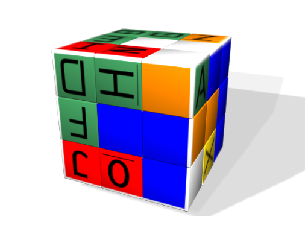
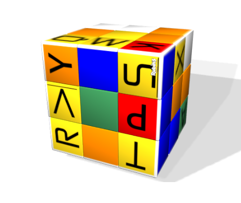
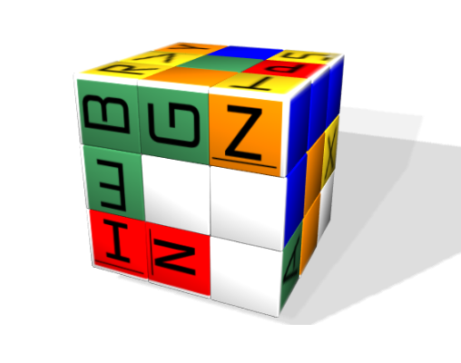
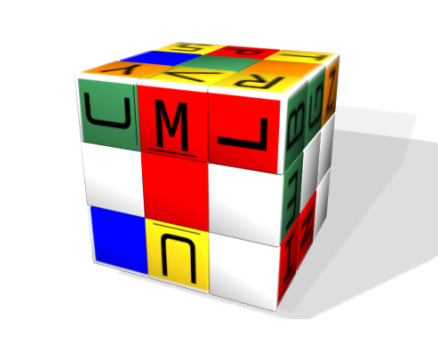
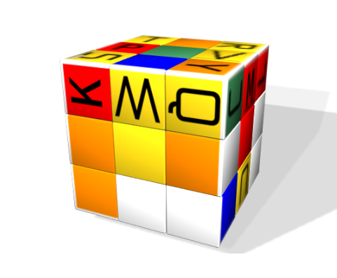
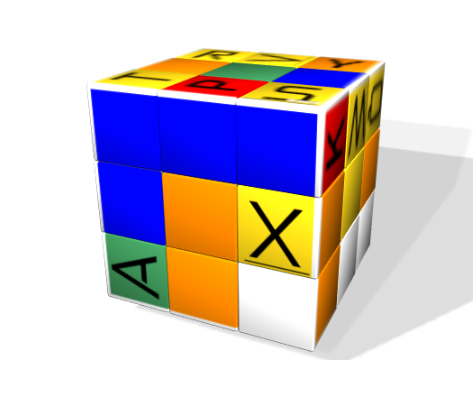
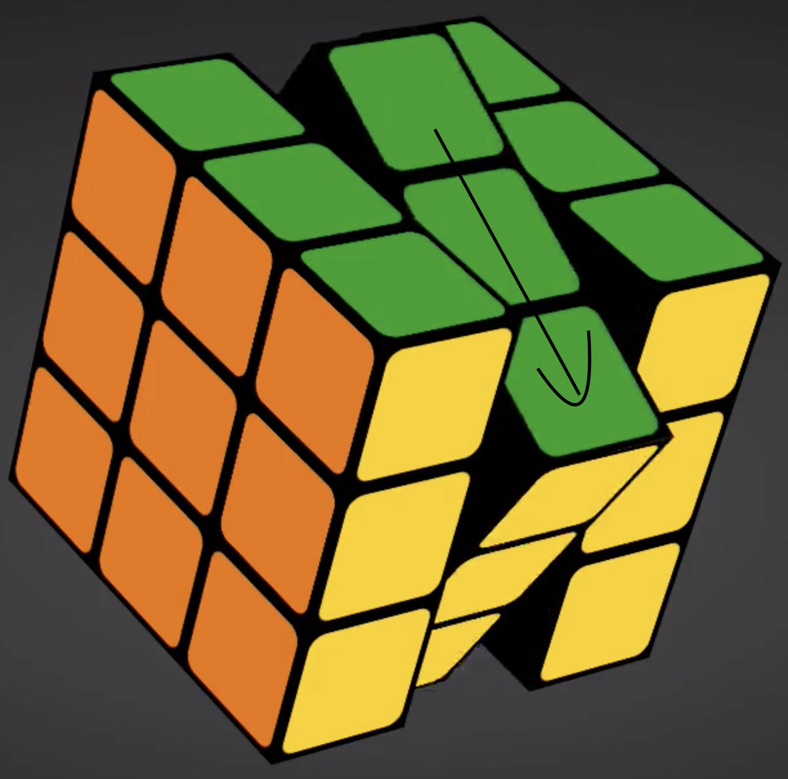
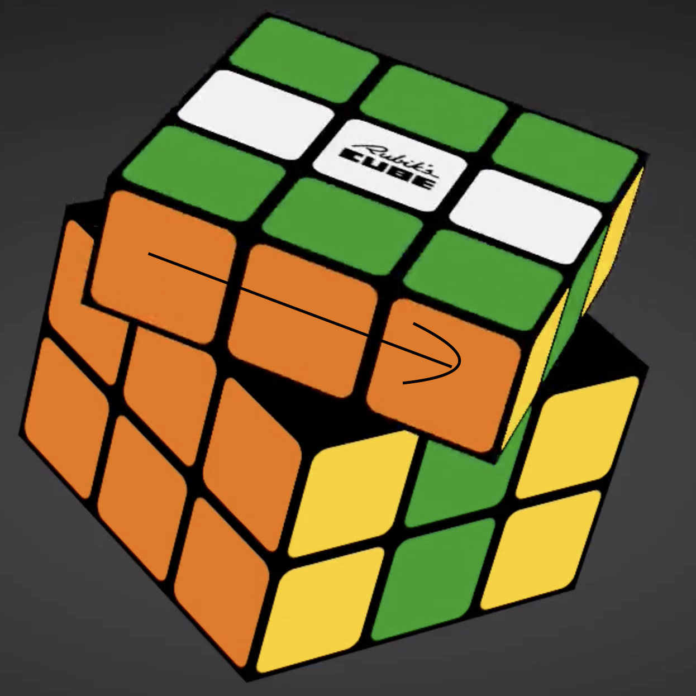

## Cubeworld #1 writeup:

Challenge information:

The 80's called. They left a very strange message.

Submit the flag in this format:
HackTM{words_you_find}

We start by downloading the challenge files: challenge_files_1.zip.
Unzipping this gives us multiple files:

```
.
├── c
│   ├── 1.mp4
│   ├── 2.mp4
│   ├── 3.mp4
│   ├── 4.mp4
│   └── 5.mp4
├── key
│   ├── key_1.png
│   ├── key_2.png
│   ├── key_3.png
│   ├── key_4.png
│   ├── key_5.png
│   └── key_6.png
└── words.txt
```

When looking for the first time at the challenge, you could see that this was about Rubik's cubes. 
Now it's up to you: find a rubik's cube program to solve this or do it manually...
If you chose the second option, congrats! Now go turn your room inside out and find that dusty cube, it's cubing time!

The "c" directory contains 5 videos which probably represent the 5 encrypted words.  
The "key" directory contains the 6 faces of the cube. Each face has letters facing different directions. The directions are very important, you'll see why when we get to the decoding part!  
words.txt is just a wordlist that allows to restrain all the possible outcomes of the cube.

#### Step 1 

We started by mapping the color configuration of the cube on an online cube solver. 






Once this was done, the solver gave us the steps to get to a solved cube. Sweet! We reverse the operation and end up with the exact same cube as the pictures in the key folder. We then proceeded to write each letter on the cube and still using the online solver, we put the cube back into a solved state.

### Step 2

Looking at each video, we saw that rotations were performed. We figured out that each rotation represents a letter, constructing a word.
For each video, you have to start from a solved cube and read the letters in the direction of the rotation.  
For instance, the first rotation of the first video gives the letter {W}  


and the second letter {E}.



"we" is a valid word in words.txt, we thus have our first word.

For some videos we had multiple letters for one rotation. A very simple solution for this is performing a regex search in words.txt
For instance in videos 4.mp4, we get a 7 letter word composed of the following letters:  {A,E,D}{N}{G,K}{I}{N}{B,Y,E,D,L}{S}.  
This translates as \(\[aed\]\)\(\[n\]\)\(\[gk\]\)\(\[i\]\)\(\[n\]\)\(\[byedl\]\)\(\[s\]\) in regex form.
Two words can be found in the wordlist with this regex: engine and eugene.

Going through the 5 videos, you get the following sentence:  
we  
need  
more  
rotary  
engines.

The flag is HackTM{we_need_more_rotary_engines}